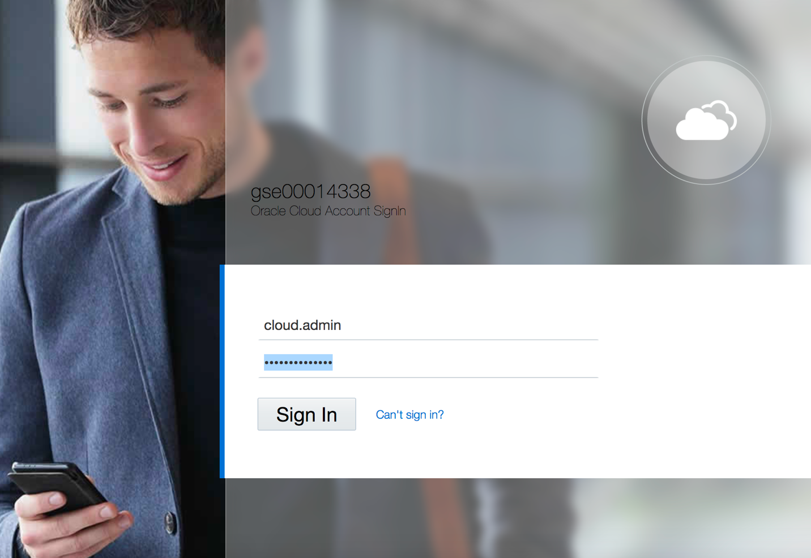

# OCI Fundamentals - Test Drive

The instructions for the 1 hour test drive video that you saw during the webinar. Follow these instructions to build your own load balanced web server.

## Table of Contents

- [OCI Fundamentals - Test Drive](#oci-fundamentals---test-drive)
  - [Table of Contents](#table-of-contents)
  - [Overview](#overview)
  - [Prerequisites](#prerequisites)
  - [Lab 1 - Creating SSH Keys](#lab-1---creating-ssh-keys)
    - [WINDOWS](#windows)
    - [MAC/LINUX](#maclinux)
  - [Lab 2 - Logging into Oracle Cloud Infrastructure](#lab-2---logging-into-oracle-cloud-infrastructure)
    - [Console Overview](#console-overview)
  - [Lab 3: Creating Compartments](#lab-3-creating-compartments)
    - [Compartments Overview](#compartments-overview)
  - [Lab 4 - Creating a Virtual Cloud Network](#lab-4---creating-a-virtual-cloud-network)
    - [Summary](#summary)
  - [Lab 5 - Compute Instances](#lab-5---compute-instances)
    - [Troubleshooting](#troubleshooting)
  - [Lab 6 - Custom Images](#lab-6---custom-images)
  - [Lab 7 - Using Custom Images](#lab-7---using-custom-images)
  - [Lab 8 - Creating a Load Balancer](#lab-8---creating-a-load-balancer)

## Overview

In this set of labs you will learn how to use Oracle Cloud Infrastructure (OCI) to create a redundant, load balanced set of web servers. As a part of this overarching goal, you will learn how to create and configure a virtual cloud network, routing rules, compute instances and more. By the end of this series of labs you will have had experience building a real world solution that is scalable and reliable. This lab aloe will not grant you mastery of OCI and its technologies, but it will take you from "zero to 60" very quickly.

This set of abs may appear daunting at first, due to their sheer number and size. However, it appears long because of all of the screenshots and detailed step-by-stp instructions. Remember, I was able to demnstrate all of this in an hour!

[Top](#table-of-contents)

## Prerequisites

To perform these labs you must have the following:

1. A Windows/Mac/Linux machine that can connect to the internet
2. Internet access
3. Basic familiarity with using the command line (aka the terminal). You don't need any coding experience (though it helps) because I will walk you through each step.

[Top](#table-of-contents)

## Lab 1 - Creating SSH Keys

To connect to some of our "assets" in OCI, you will need to create your own SSH key. SSH stand for "Secure Shell" and is a protocol nd technology for remotely connecting to computers using the command line. You wont use it alot in this set of labs, but you will need it for some.

The process of creating your own SSH keys varies depending on your platform. Choose your platform below and follow those instructions to create your SSH keys.

### WINDOWS

1. Install git for windows. Download the latest release from [Gitbash](https://github.com/git-for-windows/git/releases) and install.

2. Run Git-bash:

3. Enter the following command:

    ```shell
    ssh-keygen -f oci_testdrive -C "My OCI Test Drive SSH key"
    ```

    ***When prompted for the passphrase you my leave it blank.***
    
    This will create two files in your current directory. The first file is names **oci_testdrive** and it is your SSH private key. You d not share this key with anyone or any computer system. The second file is named **oci_testdrive.pub**. This is your public SSH key and it is the key you will upload to the OCI compute instances that you will create later in this set o labs.

4. Make sure permissions are restricted, sometimes ssh will fail if private keys have permissive permissions.

    ```shell
    chmod 0700 .
    chmod 0600 oci_testdrive
    chmod 0644 oci_testdrive.pub
    ```

**Note**: In Gitbash, the directory `C:\\Users\\username\\` is shown as `/c/Users/username/`

**NOTE**
These instructions will create a minimally secure ssh key for you (***and one well suited for this tutorial***). For production environments we recommend an SSH-2 RSA key with 4096 bits and a passphrase. Here is the sample command format:

```shell
ssh-keygen -t rsa -b 4096 -N "<myPassphrase>" -f <key file name> -C "This is my comment"
```

And for a concrete example:

```shell
ssh-keygen -t rsa -b 4096 -N "MySecretPhrase" -f my_oci_key -C "This is my comment"
```

### MAC/LINUX

1. Enter the following command if you are using MAC or Linux Desktop:

    ```shell
      ssh-keygen -f oci_testdrive -C "My OCI Test Drive SSH key"
    ```

    ***When prompted for the passphrase you my leave it blank.***
    
    This will create two files in your current directory. The first file is names **oci_testdrive** and it is your SSH private key. You d not share this key with anyone or any computer system. The second file is named **oci_testdrive.pub**. This is your public SSH key and it is the key you will upload to the OCI compute instances that you will create later in this set o labs.

2. Make sure permissions are restricted, sometimes ssh will fail if private keys have permissive permissions.

    ```shell
        chmod 0700 .
        chmod 0600 oci_testdrive
        chmod 0644 oci_testdrive.pub
    ```

**NOTE**
These instructions will create a minimally secure ssh key for you (***and one well suited for this tutorial***). For production environments we recommend an SSH-2 RSA key with 4096 bits and a passphrase. Here is the sample command format:

```shell
ssh-keygen -t rsa -b 4096 -N "<myPassphrase>" -f <key file name> -C "This is my comment"
```

And for a concrete example:

```shell
ssh-keygen -t rsa -b 4096 -N "MySecretPhrase" -f my_oci_key -C "This is my comment"
```

[Top](#table-of-contents)

## Lab 2 - Logging into Oracle Cloud Infrastructure

### Console Overview

In this practice, you sign in to the Oracle Cloud Infrastructure console using your credentials.

1. Open a supported browser and go to the Console URL:  [https://oracle.com](https://oracle.com).

2. Click on the portrait icon in the top-right section of the browser window, then click on the **Sign in to Cloud** link.

   

3. Enter the name of your tenancy (aka your account name, not your user name), then click on the **Next** button.

   

4. Oracle Cloud Infrastructure is integrated with Identity Cloud Services, you will see a screen validating your Identity Provider. Enter your username and password. Click **Sign In**.

   

5. When you sign in to the Console, the dashboard is displayed.

   

## Lab 3: Creating Compartments

### Compartments Overview

A compartment is a collection of cloud assets, like compute instances, load balancers, databases, etc. By default, a root compartment was created for you when you created your tenancy (ie when you registered for the trial account). It is possible to create everything in the root compartment, but Oracle recommends that you create sub-compartments to help manage your resources more efficiently.

1. From the menu, select **Identity** and **Compartments**. You will have to scroll all the way to the bottom of the main menu to find the Identity menu item.

   

2. Click on the blue **Create Compartment** button to create a sub-compartment.

   

3. Name the compartment **Demo** and provide a short description. Be sure your root compartment is shown as the parent compartment. Press the blue **Create Compartment** button when ready.

   

4. You have just created a compartment for all of your work in this Test Drive.

[Top](#table-of-contents)

## Lab 4 - Creating a Virtual Cloud Network

A virtual cloud network (VCN) is a customizable and private network in Oracle Cloud Infrastructure. Just like a traditional data center network, the VCN provides you with complete control over your network environment. This includes assigning your own private IP address space, creating subnets, route tables, and configuring stateful firewalls. A single tenant can have multiple VCNs, thereby providing grouping and isolation of related resources. Oracle’s new 25Gb network infrastructure offers significantly more bandwidth and allows enterprises to cost effectively take full advantage of compute, storage, and database services.

To create a VCN on Oracle Cloud Infrastructure:

1. On the Oracle Cloud Infrastructure Console Home page, under the Quick Actions header, click on Set up a network with a wizard.

    

2. Select **VCN with Internet Connectivity**, and then click **Start Workflow**.

    

3. Complete the following fields:

    | **Field**                     |                                       **Value**                                        |
    | ----------------------------- | :------------------------------------------------------------------------------------: |
    | VCN NAME                      |                                      OCI_HOL_VCN                                       |
    | COMPARTMENT                   | Choose the ***Demo*** compartment you created in [Lab 3](#Lab-3-Creating-Compartments) |
    | VCN CIDR BLOCK                |                                      10.0.0.0/16                                       |
    | PUBLIC SUNBET CIDR BLOCK      |                                      10.0.2.0/24                                       |
    | PRIVATE SUBNET CIDR BLOCK     |                                      10.0.1.0/24                                       |
    | USE DNS HOSTNAMES IN THIS VCN |                                        Checked                                         |

    Your screen should look similar to the following:

    

4. Press the **Next** button at the bottom of the screen.

5. Review your settings to be sure they are correct.
    

6. Press the **Create** button to create the VCN. I will take a moment to create the VCN and a progress screen will keep you apprised of the workflow.

    

7. Once you see that the creation is complete (see previous screenshot), click on the **View Virtual Cloud Network** button.

### Summary

This VCN will contain all of the other assets that you will create during this set of labs. In real-world situations, you may well create multiple VCNs based on their need for access (which ports to open) and who can access them. Both of these concepts are covered in the next lab [Lab 5 - Compute Instances](##lab-5---compute-instances)

[Top](#table-of-contents)

## Lab 5 - Compute Instances

Oracle Cloud Infrastructure Compute lets you provision and manage compute hosts, known as instances. You can launch instances as needed to meet your compute and application requirements. After you launch an instance, you can access it securely from your computer, restart it, attach and detach volumes, and terminate it when you're done with it. Any changes made to the instance's local drives are lost when you terminate it. Any saved changes to volumes attached to the instance are retained.

Oracle Cloud Infrastructure offers both bare metal and virtual machine instances:

- **Bare Metal**  - A bare metal compute instance gives you dedicated physical server access for highest performance and strong isolation.
- **Virtual Machine**  - A Virtual Machine (VM) is an independent computing environment that runs on top of physical bare metal hardware. The virtualization makes it possible to run multiple VMs that are isolated from each other. VMs are ideal for running applications that do not require the performance and resources (CPU, memory, network bandwidth, storage) of an entire physical machine.

An Oracle Cloud Infrastructure VM compute instance runs on the same hardware as a Bare Metal instance, leveraging the same cloud-optimized hardware, firmware, software stack, and networking infrastructure.

For more details on compute instances, please refer to the official [Oracle Compute Instance](https://docs.cloud.oracle.com/en-us/iaas/Content/Compute/Concepts/computeoverview.htm) web page.

1. Navigate to the **Compute** tab and click **Create Instance**. We will launch a VM instance for this lab.

2. The Create Compute Instance wizard will launch. Set the name of the server to *Web-Server*. Click on the *Show Shape, Networking, Storage Options* link to expand that area of the page.
    

3. Most of the defaults are perfect for our purposes. However, you will need to scroll down to the Configure Networking area of the page and select the *Assign a public IP address* option.
    

    ***NOTE:*** *You need a public IP address so that you can SSH into the running instance later in this lab.*

4. Scroll down to the SSH area of the page. Choose the *oci_testdrive.pub* SSH key that you created earlier in this lab. Press the *Create* button to create your instance.

    Launching an instance is simple and intuitive with few options to select. The provisioning of the compute instance will complete in less than a minute and the instance state will change from provisioning to running.

5. Once the instance state changes to Running, you can SSH to the Public IP address of the instance.

    

6. To connect to the instance, you can use `Terminal` if you are using MAC or `Gitbash` if you are using Windows. On your terminal or gitbash enter the following command:

    **Note:** For Oracle Linux VMs, the default username is **opc**

    ```shell
    ssh opc@<public_ip_address>
    ```

    If you have a different path for your SSH key enter the following:

    ```shell
    ssh -i <path_to_private_ssh_key> opc@<public_ip_address>
    ```

    **Note** Most likely, the SSH keys that you created at the start of these  labs will be located in your home folder.

7. For this lab, we are going to install an Apache HTTP Webserver and try to connect to it over the public Internet. SSH into the Linux instance and run following commands:

    **Note** *Apache HTTP Server is an open-source web server developed by the Apache Software Foundation. The Apache server hosts web content, and responds to requests for this content from web browsers such as Chrome or Firefox.*

    - Install Apache http

      ```shell
      sudo yum install httpd -y
      ```

    - Start the apache server and configure it to start after system reboots

      ```shell
      sudo apachectl start
      sudo systemctl enable httpd
      ```

    - Run a quick check on apache configurations

      ```shell
      sudo apachectl configtest
      ```

    - Create firewall rules to allow access to the ports on which the HTTP server listens.

      ```shell
      sudo firewall-cmd --permanent --zone=public --add-service=http
      sudo firewall-cmd --reload
      ```

    - Create an index file for your webserver

      ```shell
      sudo bash -c 'echo This is my Web-Server running on Oracle Cloud Infrastructure >> /var/www/html/index.html'
      ```

8. Open your browser and navigate to `http://<public IP>` (the IP address of your Linux VM compute instance)

    **NOTE:** Your browser will not return anything because port 80 was not opened into the Security Lists

9. Using the menu, click on **Virtual Cloud Network** and then the VCN you created for this practice.

    

10. Now click on **Security Lists** on the left navigation bar for the VCN.
    

11. Click on the **Default Security List**.

12. Here you need to open port 80. Click on **+ Another Ingress Rule** and add the following values as shown below:

    - **Source Type:** CIDR
    - **Source CIDR**: 0.0.0.0/0
    - **IP Protocol:** TCP
    - **Source Port Range:** All
    - **Destination Port Range:** 80
    - Click on **Add Ingress Rules** at the bottom.

    

13. Navigate to `http://<public_ip_address>` (the IP address of the Linux VM) in your browser. And now you should see the index page of the webserver we created above.

    

### Troubleshooting

If you are unable to see the webserver on your browser, possible scenarios include:

- VCN Security Lists is blocking traffic, Check VCN Security List for ingress rule for port 80
- Firewall on the linux instance is blocking traffic
  
  - `# sudo firewall-cmd --zone=public --list-services` (this should show http service as part of the public zone)
  - `# sudo netstat -tulnp | grep httpd` (an httpd service should be listening on the port 80, if it’s a different port, open up that port on your VCN SL)

- Your company VPN is blocking traffic.

[Top](#table-of-contents)

## Lab 6 - Custom Images

Well done! So far you have 1 single running web server, but of course, in a production environment you're likely to have multiple copies of that server running to handle the traffic. Can you imagine having to repeat those steps for dozens or even hundreds of web servers? That would be madness! The answer is to create a custom image of our compute instance and use it as a template to create additional web server instances, configured in the exact same way, quickly and easily.

1. Using the main menu, navigate to the Compute -> Instances menu.
2. When you see your ***Web-Server*** instance in the lit, click on it to view its details.
3. Click on the ***More*** button at the top of the page and click the ***Create Custom Image*** button.
  

4. Be sure you have the ***Demo*** compartment selected. Custom image are specific to a compartment. Name the image ***Web-Server_Image*** and press the ***Create Custom Image*** button.
  

5. This will close the dialog and you will see from the orange status icon in the upper left corner of the instance page that the image is being created. It will take several minutes for this to complete.
  

6. When the status icon turns green, your custom image is ready for use. You can see your custom image if you select ***Compute -> Custom Images*** from the main menu.
  

7. Click on your newly created custom image to view its details.
  

Your custom image is now ready for use!

Custom images are extremely useful. You can create a custom image and then use it to create compute instances in different environments (ie. Dev, Test and Production for example).They help you to guarantee the integrity of each compute instance you create with it.

[Top](#table-of-contents)

## Lab 7 - Using Custom Images

Now that we have a custom image created, let's use it to create a new compute instance that is a duplicate of our first web server. In our next and final lab, we will then create a load balancer to balance incoming web traffic between the two web servers.

1. Using the main menu, select **Compute -> Instances** and click **Create Instance**.

2. The Create Compute Instance wizard will launch. Set the name of the server to *Web-Server2*. Click on the ***Change Image*** button.
  

3. A list of images will appear. Click on the ***Custom Images*** tab.
  

4. Check the checkbox for the ***Web-Server_Image*** and press the ***Select Image*** button.
  

5. Use the default Availability Domain. Scroll down and select the ***DO NOT ASSIGN A PUBLIC IP ADDRESS*** radio button.
  
  ***NOTE:*** *You ***DO NOT*** need a public IP address for this instance because it is already configured. so that you can SSH into the running instance later in this lab.*

6. Scroll down to the SSH area of the page. Choose the *oci_testdrive.pub* SSH key that you created earlier in this lab. Press the ***Create*** button to create your instance.
  

7. Wait for the new instance to complete the provisioning process. Note that you cannt point your web server to this instance to test it because it does not have a public IP address! That's ok though. In the next and final lab we will create a load balancer that ***DOES*** have a public IP address and it will load balance across the two web servers that you created.

[Top](#table-of-contents)

## Lab 8 - Creating a Load Balancer

